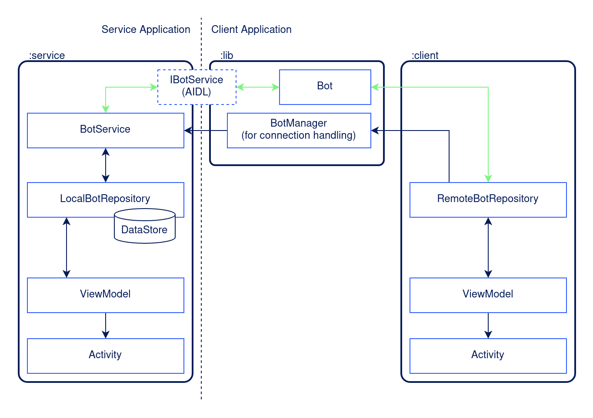

# Android Service Kotlin API demo

This companion repository contains two demo applications to show how we can design
modern and concurrent Kotlin APIs for our Android bound service with an AIDL inteface.

It basically is a dummy chat bot which provides an API for third party apps. Here you can see
the basic architecture with both the service app and a demo client application consuming our API.

Article URL will follow soon.

## License

This project is licensed under the terms of the Apache 2.0 license.